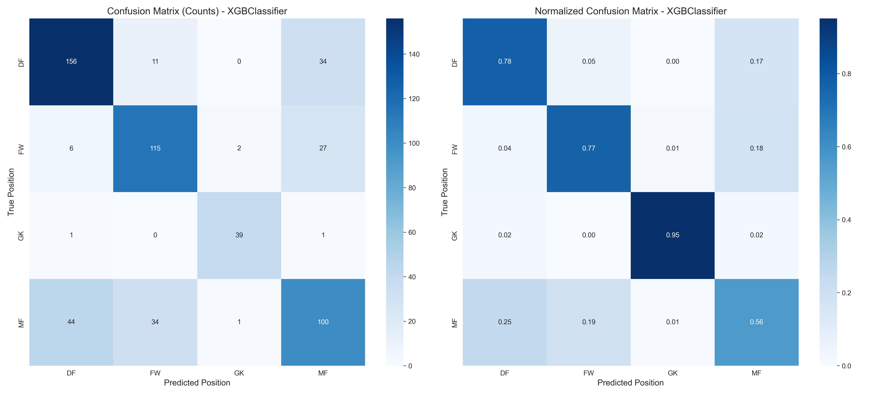

# Football Player Position Prediction

This project uses machine learning to predict football player positions based on performance statistics from the top 5 European leagues. It demonstrates how to use player statistics like goals, assists, expected goals (xG), progressive passes, and defensive actions to classify players into their primary positions: Defender (DF), Forward (FW), Goalkeeper (GK), and Midfielder (MF).



## Features

- **Data Preprocessing Pipeline**: Clean and prepare football statistics data for machine learning
- **Exploratory Data Analysis**: Visualize relationships between player statistics and positions
- **Model Training & Evaluation**: Train and compare multiple classification algorithms
- **Feature Importance Analysis**: Identify key statistics that determine player positions
- **Misclassification Analysis**: Understand why certain positions are harder to predict
- **Visualization Suite**: Generate insightful visualizations of model performance
- **Prediction Interface**: Use the trained model to predict positions for new players

## Project Structure

```
├── README.md                           # Project documentation
├── requirements.txt                    # Python dependencies
├── football_position_prediction.ipynb  # Main analysis notebook
├── model_pipeline.py                   # Modular ML pipeline functions
├── main.py                             # Example script for using the model
├── artifacts/                          # Model outputs and visualizations
│   ├── accuracy.txt                    # Model accuracy metrics
│   ├── classification_report.txt       # Detailed classification metrics
│   ├── classification_report_heatmap.png # Visual classification report
│   ├── confusion_matrix.png            # Prediction vs actual visualization
│   ├── feature_importance.png          # Important features chart
│   ├── model_summary.txt               # Performance summary
│   ├── position_classifier.joblib      # Saved model file
│   └── roc_curves.png                  # ROC curves for model evaluation
└── data/                               # Dataset directory
    └── top5-players.csv                # Player statistics dataset
```

## Dataset

The dataset contains season-level statistics for players from the top 5 European leagues (Premier League, La Liga, Serie A, Bundesliga, and Ligue 1), including:

- **Player Information**: Age, team, league, nationality
- **Basic Statistics**: Goals, assists, minutes played, cards
- **Advanced Metrics**: Expected goals (xG), expected assists (xAG)
- **Progression Metrics**: Progressive passes, progressive carries
- **Per-90 Statistics**: Goals per 90 minutes, assists per 90 minutes, etc.

## Setup and Installation

1. Clone the repository
2. Create a virtual environment (recommended):
   ```bash
   python -m venv venv
   source venv/bin/activate  # On Windows: venv\Scripts\activate
   ```
3. Install dependencies:
   ```bash
   pip install -r requirements.txt
   ```

## Usage

### Jupyter Notebook

The main analysis is contained in `football_position_prediction.ipynb`. To run the analysis:

1. Ensure you have Jupyter installed
2. Open the notebook:
   ```bash
   jupyter notebook football_position_prediction.ipynb
   ```
3. Run all cells to:
   - Load and preprocess the data
   - Perform exploratory data analysis
   - Train and evaluate models
   - Generate visualizations

### Using the Model Pipeline

The `model_pipeline.py` module provides reusable functions for the entire machine learning pipeline:

```python
from model_pipeline import run_full_pipeline

# Run the entire pipeline with a single function call
results = run_full_pipeline('data/top5-players.csv')
```

### Making Predictions with main.py

The `main.py` script demonstrates how to use the trained model for predictions:

```bash
# Run the example prediction script
python main.py
```

To use the model for your own player data:

```python
import pandas as pd
from main import load_model, predict_position, display_results

# Load the model
model = load_model('artifacts/position_classifier.joblib')

# Create player data (example with custom player stats)
player_stats = {
    'Age': [25],
    'Gls': [5],
    'Ast': [10],
    # Add all required features...
}
player_data = pd.DataFrame(player_stats)

# Make prediction
predicted_position = predict_position(model, player_data)

# Display results
display_results(predicted_position, "Unknown")
```

## Model Performance

The project compares several classification models:

- Logistic Regression
- Random Forest
- XGBoost (typically the best performer)
- K-Nearest Neighbors

### Evaluation Metrics

- **Accuracy**: ~72% overall accuracy on the test set
- **F1-Scores**: Varies by position (GK: 0.94, DF: 0.76, FW: 0.74, MF: 0.59)
- **Confusion Matrix**: Visual representation of prediction accuracy
- **ROC-AUC Curves**: Performance across different classification thresholds

### Key Insights

- **Goalkeeper (GK)** is the easiest position to predict due to unique statistics
- **Midfielder (MF)** is the most challenging position to predict due to:
  - Tactical versatility (defensive to attacking roles)
  - Statistical overlap with both defenders and forwards
  - Position fluidity in modern football

### Feature Importance

The most important features for position prediction include:

- Goal-related metrics (Gls, G+A, G-PK) for distinguishing forwards
- Assist metrics (Ast, xAG) for identifying midfielders
- Defensive metrics for identifying defenders
- Specialized goalkeeper statistics

## Visualizations

The project generates several visualizations to help understand the data and model performance:

- **Position Distribution**: Count of players in each position
- **Feature Distributions by Position**: Boxplots showing statistical patterns
- **Correlation Heatmap**: Relationships between numerical features
- **Confusion Matrix**: Model prediction accuracy by position
- **Classification Report Heatmap**: Precision, recall, and F1-score visualization
- **ROC-AUC Curves**: Model performance across different thresholds
- **Feature Importance**: Most influential features for prediction
- **Misclassification Analysis**: Patterns in prediction errors

## Contributing

Contributions to improve the project are welcome! Some potential areas for enhancement:

1. Adding more sophisticated feature engineering
2. Implementing hyperparameter tuning
3. Exploring additional models or ensemble methods
4. Improving handling of multi-position players
5. Adding more visualizations or analyses

## License

This project is licensed under the MIT License - see the LICENSE file for details.

## Acknowledgments

- Dataset curated by Orkun Aktas
- Inspired by the growing use of data analytics in football
